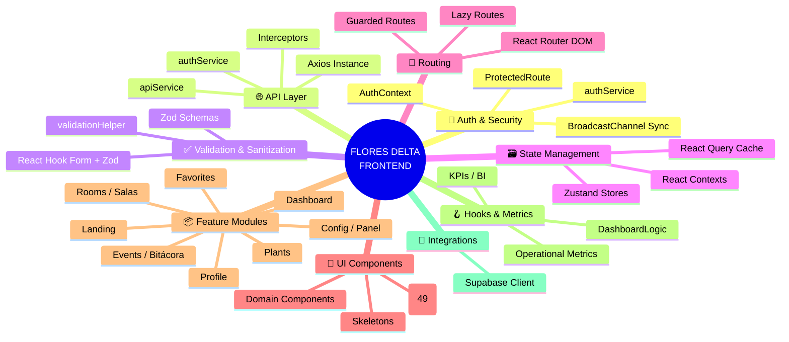
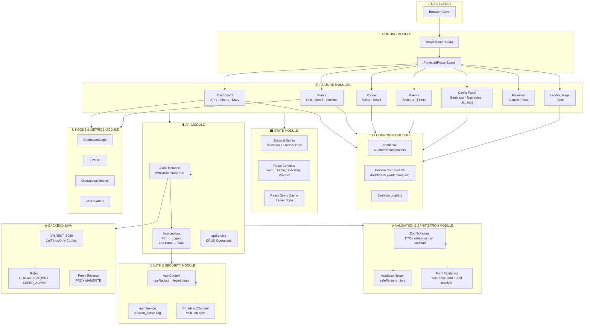
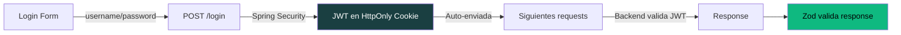
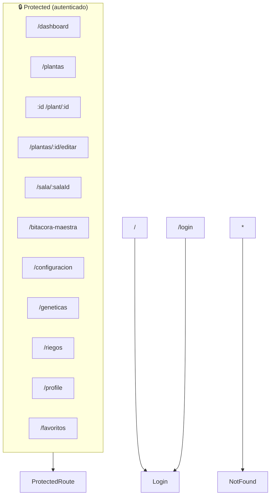
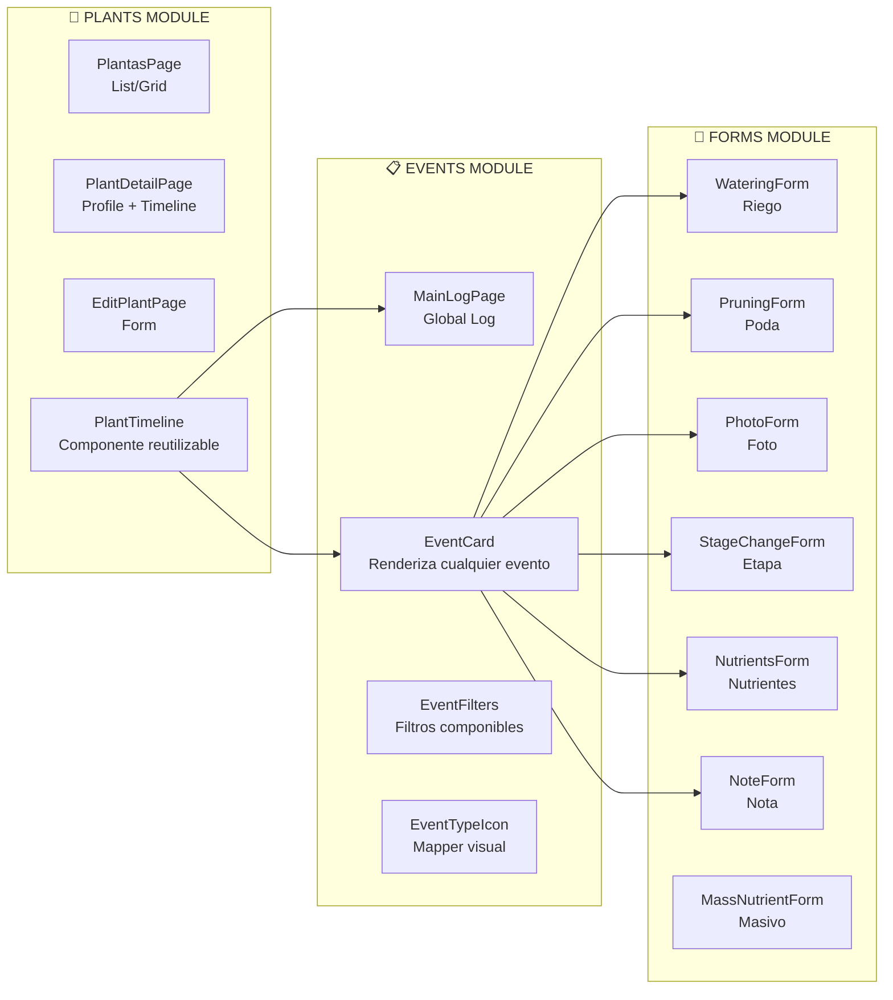
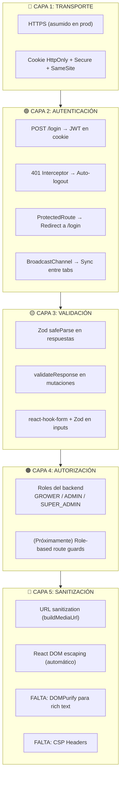
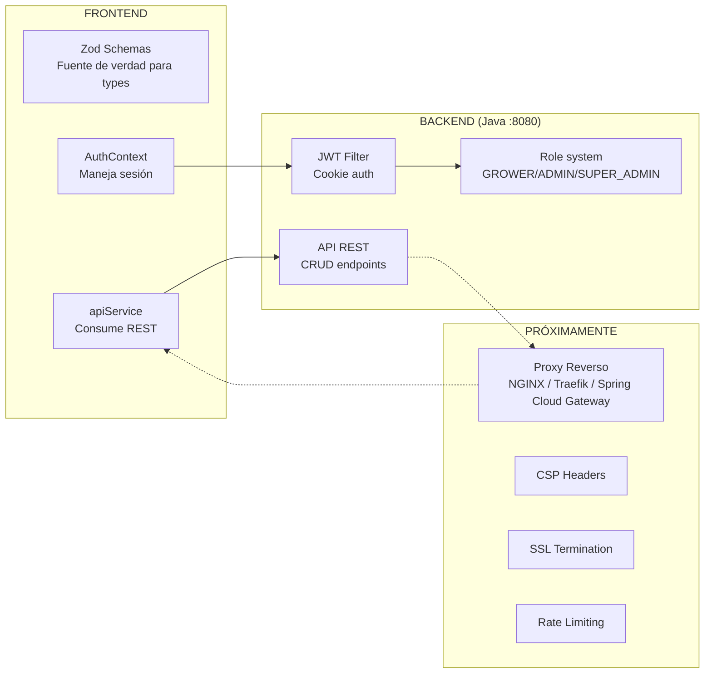

# 🏗️ FLORES DELTA — Frontend Modular Report

> **Versión:** 1.0 · **Propósito:** Mapa arquitectónico modular del frontend con foco en escalabilidad, seguridad y sanitización
> **Backend:** Seguridad token JWT (HttpOnly cookie) + Roles (GROWER/ADMIN/SUPER_ADMIN) + Proxy reverso (próximamente)

---

## 📐 1. MAPA DE MÓDULOS — Visión General



---

## 🧱 2. ARQUITECTURA MODULAR — Por Capas



---

## 📦 3. CATÁLOGO DE MÓDULOS

### 3.1 🔐 Auth & Security Module

| Propiedad | Detalle |
|-----------|---------|
| **Archivos** | `Context/AuthContext.tsx`, `services/authService.ts`, `Components/ProtectedRoute.tsx` |
| **Ubicación** | `Context/`, `services/`, `Components/` |
| **Estado** | ✅ Implementado |

**Responsabilidad:**
- Manejar sesión del usuario (login/logout)
- NO almacenar el JWT en JS (solo cookie HttpOnly)
- Sincronizar sesión entre pestañas (BroadcastChannel)
- Proteger rutas privadas (ProtectedRoute)
- Interceptar 401 globalmente

**Escalabilidad:**
- El patrón `useReducer` permite agregar más estados de sesión (MFA, 2FA pending, etc.)
- BroadcastChannel escala a N pestañas sin costo adicional
- ProtectedRoute es un wrapper — se puede componer con verificación de roles

**Seguridad aplicada:**


**Lo que falta (próximos sprints):**
- Verificación de roles en rutas (AdminGuard, etc.)
- Refresh token rotation
- CSRF tokens si el proxy no los maneja

---

### 3.2 🌐 API Layer Module

| Propiedad | Detalle |
|-----------|---------|
| **Archivos** | `Utils/api.ts`, `services/api.ts`, `config/api.config.ts` |
| **Ubicación** | `Utils/`, `services/`, `config/` |
| **Estado** | ✅ Implementado |

**Responsabilidad:**
- Instancia única de Axios con `withCredentials: true`
- Interceptor de respuesta: 401 → logout automático
- Interceptor de respuesta: error Zod → toast al usuario
- Servicio CRUD completo tipado

**Escalabilidad:**
- `apiService` es un objeto con métodos — se agregan endpoints sin modificar estructura
- Interceptors son composables: se agregan/quitan sin tocar la lógica de negocio
- Base URL via `VITE_API_URL` = 12factor compliant

**Sanitización:**
```typescript
// ✅ Validación runtime de TODAS las respuestas
const parsed = z.array(PlantaDtoSchema).safeParse(response.data);
if (!parsed.success) {
    console.error("❌ Backend violó contrato:", parsed.error.issues);
    throw new Error("Invalid server response");
}
return parsed.data;
```

**Endpoints cubiertos:**

| Recurso | CRUD | Validación Zod |
|---------|------|---------------|
| Plantas | ✅ GET/POST/PUT/DELETE | ✅ SafeParse en GET y POST |
| Salas | ✅ GET/POST/PUT/DELETE | ✅ SafeParse en GET y POST |
| Cepas | ✅ GET/POST/PUT/DELETE | ✅ SafeParse en GET |
| Nutrientes | ✅ GET/POST/PUT/DELETE | ✅ SafeParse en GET |
| Usuarios | ✅ GET | ✅ SafeParse |
| Eventos | ✅ GET/POST/PUT/DELETE | ❌ Sin validación Zod aún |
| Favoritos | ✅ POST/DELETE/GET | ❌ Sin validación Zod |

---

### 3.3 ✅ Validation & Sanitization Module

| Propiedad | Detalle |
|-----------|---------|
| **Archivos** | `schemas/DTOSchemas.ts`, `Utils/validationHelper.ts`, `interfaces/Eventos.ts` |
| **Ubicación** | `schemas/`, `Utils/`, `interfaces/` |
| **Estado** | ✅ Implementado (Fase 3) |

**Responsabilidad:**
- Fuente de verdad única para tipos (Zod schema → TypeScript type)
- Validación runtime de respuestas del backend
- Helper genérico `validateResponse<T>()` para mutaciones
- Interfaces de eventos tipadas manualmente

**Escalabilidad:**
- Schemas Zod son 100% independientes — se actualizan por dominio
- `validateResponse` es genérico: `validateResponse(Schema, data, context)`
- Types inferidos evitan duplicación manual

**Sanitización actual:**

| Punto de entrada | Sanitización | Estado |
|-----------------|-------------|--------|
| Formularios (react-hook-form) | Zod resolver | ✅ |
| Respuestas GET backend | Zod safeParse | ✅ |
| Respuestas POST/PUT backend | validateResponse | ✅ |
| URLs de medios | buildMediaUrl() | ✅ |
| User input en búsqueda | Ninguna (solo query params) | ⚠️ Básico |
| Rich text / HTML | No implementado | ❌ |
| DOMPurify o equivalente | No implementado | ❌ |

**⚠️ Riesgo:** Si el backend llegara a devolver HTML o scripts en alguna respuesta (eventos con rich text, descripciones), NO hay sanitización al renderizar. Recomendación: agregar DOMPurify antes de `dangerouslySetInnerHTML` si aparece.

---

### 3.4 🗃️ State Management Module

| Propiedad | Detalle |
|-----------|---------|
| **Archivos** | 2 Zustand stores + 4 Context providers |
| **Ubicación** | `stores/`, `Context/` |
| **Estado** | ✅ Implementado |

**Estrategia:**

```
┌──────────────────────────────────────────┐
│           STATE MANAGEMENT               │
├────────────┬─────────────────────────────┤
│ CLIENT     │ SERVER                      │
│ STATE      │ STATE                       │
├────────────┼─────────────────────────────┤
│ Zustand    │ React Query                 │
│ (2 stores) │ (TanStack Query 5)          │
│            │                             │
│ • Plant    │ • Plantas queryKey          │
│   Selection│ • Salas queryKey            │
│ • Direct   │ • Cepas queryKey            │
│   Access   │ • Eventos queryKey          │
│            │ • Favorites queryKey        │
├────────────┴─────────────────────────────┤
│ React Context (Auth, Theme, Snack, Prod) │
└──────────────────────────────────────────┘
```

**Escalabilidad:**
- Server State via React Query = caché, staleTime, refetch, optimistic updates
- Client State via Zustand = liviano, sin boilerplate, selectors
- Context para state que cambia poco (theme) o es global (auth)
- Si crece: migrar de Context a Zustand para evitar re-renders en cadena

---

### 3.5 🧭 Routing Module

| Propiedad | Detalle |
|-----------|---------|
| **Archivos** | `App.tsx`, `Components/ProtectedRoute.tsx` |
| **Ubicación** | Raíz `src/` |
| **Estado** | ✅ Implementado |

**Estructura de rutas:**



**Escalabilidad:**
- `<ProtectedRoute />` es un Outlet — cualquier ruta nueva se anida adentro
- Rutas como `/geneticas` y `/riegos` reusan el mismo componente con `defaultTab`
- Fácil agregar lazy loading con `React.lazy()` cuando el bundle crezca

---

### 3.6 📦 Feature Modules

| Módulo | Páginas | Componentes Clave | Estado |
|--------|---------|-------------------|--------|
| **Dashboard** | `Dashboard.tsx` | AppSidebar, KpiCard, PlantCard, SalaCard, WeeklyChart, WeeklyCalendar, UserDiary | ✅ |
| **Plants** | `PlantasPage.tsx`, `PlantDetailPage.tsx`, `EditPlantPage.tsx` | PlantProfile, PlantTimeline, EventCard, EventFilters, PlantSelectableChip | ✅ |
| **Rooms** | `SalaDetailPage.tsx` | SalaCard | ✅ |
| **Events** | `MainLogPage.tsx` | EventCard (bitacora), EventTypeIcon, EventFilters | ✅ |
| **Config Panel** | `PanelControl.tsx` | GeneticasManager, SalasManager, NutrientesManager, UsuariosManager | ✅ |
| **Favorites** | `FavoritosPage.tsx` | — (reusa PlantCard) | ✅ |
| **Profile** | `ProfilePage.tsx` | — | ✅ |
| **Landing** | `Index.tsx` | 15 componentes landing (Header, Hero, Features, Blog, etc.) | ✅ |

**Escalabilidad por módulo:**



---

### 3.7 🪝 Hooks & Metrics Module

| Propiedad | Detalle |
|-----------|---------|
| **Archivos** | 4 hooks de métricas + hooks utilitarios |
| **Ubicación** | `hooks/metrics/`, `hooks/utils/` |
| **Estado** | ✅ Implementado |

**Métricas disponibles:**

```
📊 Quality Metrics
   ├── Plantas por etapa (GERMINACIÓN, PLANTIN, VEGETACIÓN, FLORACIÓN, COSECHADA)
   ├── Tasa de finalización
   └── Distribución general

📈 Performance Metrics
   ├── Plantas por sala
   ├── Rendimiento por sala
   └── Eficiencia de espacio

⏱ Temporal Metrics
   ├── Tiempo promedio por etapa
   ├── Duración de ciclo
   └── Proyecciones

🔧 Operational Metrics
   ├── Eventos registrados (totales, por tipo)
   ├── Actividad semanal
   └── Frecuencia de riego/poda
```

**Escalabilidad:** Los hooks están separados por dominio de métrica. Se agregan nuevos hooks sin tocar los existentes. Recharts permite agregar visualizaciones sin cambiar la lógica de datos.

---

### 3.8 🎨 UI Component Module

| Propiedad | Detalle |
|-----------|---------|
| **Archivos** | 49 componentes shadcn/ui + componentes de dominio |
| **Ubicación** | `Components/ui/`, `Components/*/` |
| **Estado** | ✅ Implementado |

**Estrategia de componentes:**

```
shadcn/ui (49 componentes atómicos)
    ├── button, input, card, dialog, sheet, etc.
    ├── sidebar, carousel, chart, sonner
    └── 100% personalizables via CSS variables + Tailwind

Domain Components (agrupados por feature)
    ├── dashboard/     → AppSidebar, KpiCard, PlantCard, SalaCard, etc.
    ├── plant/         → PlantProfile, PlantTimeline, EventCard
    ├── forms/         → 18 formularios especializados
    ├── landing/       → 15 componentes de landing page
    ├── panel/         → 4 managers de configuración
    ├── navigation/    → MobileBottomNav
    ├── events/        → EventTypeIcon
    └── bitacora/      → EventCard
```

**Escalabilidad:** Componentes atómicos + compuestos = jerarquía clara. Agregar una feature nueva = crear carpeta nueva en `Components/`, no tocar el resto.

---

## 🛡️ 4. SEGURIDAD FRONTEND — Análisis Completo

### 4.1 Esquema de Defensa en Capas



### 4.2 Matriz de Seguridad

| Amenaza | Mitigación Actual | Estado |
|---------|------------------|--------|
| **XSS (Cross-Site Scripting)** | React escapa output por defecto + Sin `dangerouslySetInnerHTML` | ✅ Bueno |
| **XSS en rich text / descripciones** | No hay rich text inputs aún | ⚠️ Preparar |
| **JWT robado (XSS)** | JWT en HttpOnly cookie — inaccesible desde JS | ✅ Excelente |
| **CSRF** | Cookie SameSite + withCredentials | ✅ Bueno |
| **Man-in-the-Middle** | HTTPS (asumido en producción) | ✅ Estándar |
| **Inyección en queries** | Zod valida tipos en requests salientes | ✅ Bueno |
| **Session hijacking** | Sin refresh token aún | ⚠️ Mejorable |
| **Fuerza bruta login** | Backend-side (sin rate limit en frontend) | ⚠️ Backend |
| **Cliclacking** | Sin frame-ancestors CSP aún | ❌ Ausente |
| **Content Injection** | Sin CSP headers | ❌ Ausente |

### 4.3 Sanitización — Estado Actual

```typescript
// ✅ LO QUE SE HACE BIEN:

// 1. Validación runtime de TODO lo que llega del backend
const parsed = PlantaDtoSchema.safeParse(response.data);

// 2. Validación de formularios antes de enviar
const formSchema = z.object({
  nombre: z.string().min(1, "Nombre requerido"),
  etapa: z.enum(['GERMINACION', 'PLANTIN', 'VEGETACION', 'FLORACION', 'COSECHADA']),
});

// 3. URLs de medios sanitizadas
export const buildMediaUrl = (relativePath: string): string => {
    if (relativePath.startsWith('http')) return relativePath;
    return `${API_CONFIG.baseURL}${relativePath}`;
};

// ❌ LO QUE FALTA:

// 1. DOMPurify si en futuro se renderiza HTML del backend
// import DOMPurify from 'dompurify';
// const sanitized = DOMPurify.sanitize(richTextFromBackend);

// 2. CSP Headers en nginx.conf o en el proxy futuro
// Content-Security-Policy: default-src 'self'; script-src 'self'; ...

// 3. Sanitización de búsquedas/libre input
```

---

## 📈 5. ESCALABILIDAD — Hoja de Ruta

### 5.1 Escalabilidad Horizontal (agregar features)

```
Estado actual:    [████████████░░░░] 75%
                  Cada feature nueva = crear módulo en Components/ + Page
                  React Query = cache + dedup automático
                  Zustand = estado global sin fricción

Próximo paso:     [██░░░░░░░░░░░░░░] 15%
                  Lazy loading con React.lazy() + Suspense
                  Code splitting por ruta
                  Bundle analyzer para monitorear tamaño
```

### 5.2 Escalabilidad Vertical (equipo grande)

| Aspecto | Estado | Recomendación |
|---------|--------|---------------|
| TypeScript strict mode | ❌ No | Activar `strict`, `strictNullChecks`, `noImplicitAny` |
| Tests | ❌ No | Agregar Vitest + Testing Library + Playwright |
| Storybook | ❌ No | Para catálogo de componentes compartidos |
| API contracts compartidos | ✅ Zod schemas | Ya están — exportarlos como paquete NPM si hay más clients |
| Monorepo tooling | ❌ No | Turborepo o Nx cuando el equipo crezca |
| Linting estricto | ⚠️ Básico | Agregar rules de seguridad (react/no-danger, etc.) |

### 5.3 Escalabilidad de Seguridad

```mermaid
flowchart LR
    subgraph NOW["🔵 AHORA"]
        N1[JWT HttpOnly]
        N2[Zod validation]
        N3[ProtectedRoute]
        N4[401 Interceptor]
    end

    subgraph NEXT["🟡 PRÓXIMO SPRINT"]
        X1[Role-based route guards]
        X2[CSP Headers]
        X3[Refresh token rotation]
    end

    subgraph FUTURE["🟠 FUTURO"]
        F1[DOMPurify integration]
        F2[Rate limiting client-side]
        F3[Security headers audit]
        F4[Content Security Policy]
    end

    NOW --> NEXT --> FUTURE
```



---

## 📊 6. DIAGNÓSTICO RÁPIDO

### 6.1 Health Check

| Indicador | Estado | Confianza |
|-----------|--------|-----------|
| Separación de módulos | ✅ Clara, por dominio | Alta |
| Consistencia arquitectónica | ✅ Backend-First, Zod como fuente de verdad | Alta |
| Testeabilidad | ❌ Sin tests unitarios ni E2E | Baja |
| Type Safety | ⚠️ TypeScript laxo (strictNullChecks: false) | Media |
| Seguridad autenticación | ✅ JWT HttpOnly, BroadcastChannel | Alta |
| Seguridad datos | ⚠️ Sin CSP, sin DOMPurify | Media |
| Sanitización inputs | ✅ Zod en formularios y respuestas API | Alta |
| Estado global | ✅ Mínimo necesario, bien dividido | Alta |
| Performance bundle | ⚠️ Sin code splitting | Media |
| Accesibilidad | ⚠️ Sin auditoría | Media |

### 6.2 Métricas del Frontend

```yaml
Componentes totales: ~110 (49 shadcn/ui + ~60 de dominio + skeletons)
Páginas: 12
Hooks personalizados: 10+
Schemas Zod: 6 (Planta, Sala, Cepa, User, Nutriente, PlantEvent)
Stores Zustand: 2
Context Providers: 4
Líneas de código (estimado): ~15,000 - 20,000
Dependencias: ~40 en producción
```

---

## 🔗 7. DEPENDENCIA CON BACKEND



**Contrato Frontend-Backend:**
- **Request:** JSON con Content-Type application/json (o multipart/form-data para fotos)
- **Auth:** Cookie `jwt` enviada automáticamente por el browser
- **Response:** JSON validado contra Zod schemas en runtime
- **Errores:** HTTP status codes (401 → logout, 403 → forbidden, 422 → validation)
- **Proxy futuro:** El frontend no cambia — el proxy se coloca entre el browser y el backend

---

## ✅ 8. CONCLUSIÓN

### Fortalezas del Frontend

1. **Arquitectura modular real** — no es folder-by-type, es folder-by-domain
2. **Backend-First con validación runtime** — detección temprana de contratos rotos
3. **Auth security-first** — sin JWT en localStorage, HttpOnly cookie
4. **Estado bien estratificado** — React Query para server, Zustand para client, Context para global
5. **Componentes reusables** — shadcn/ui base + composición por dominio

### Debilidades a abordar

1. **TypeScript config laxo** — `strictNullChecks: false` es una bomba de tiempo
2. **Cero tests** — para una app de datos críticos, es el riesgo #1
3. **Sin CSP ni DOMPurify** — la seguridad de contenido necesita atención
4. **Sin code splitting** — el bundle crece y no hay lazy loading
5. **Eventos sin validación Zod** — los schemas de eventos no están cubiertos

---

*Reporte generado el 11/05/2026 — Flores Delta Fullstack*
